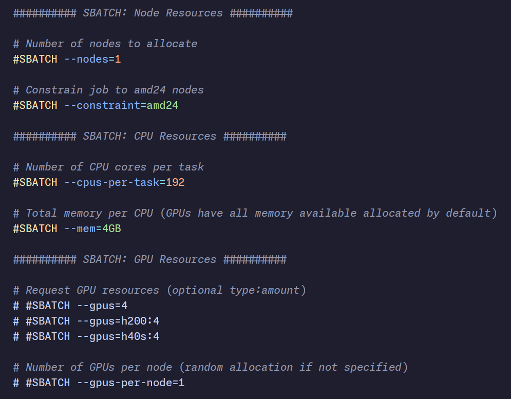

# SBATCH (Zed language extension)

Lightweight Zed grammar extension that provides syntax highlighting for SLURM `sbatch` scripts using the `tree-sitter-sbatch` grammar.



## Features
- Syntax highlighting for `#SBATCH` options and commented out `#SBATCH` lines.
- Small, dependency-free extension configuration in `extension.toml`.
- Uses bash highlighting for the rest of the script

## Issues
- Creates run icons for every bash line; not sure how to fix.

## Install
- Clone the repo and install as a dev extension in Zed.

## Development

Update the grammar in `tree-sitter-sbatch` and then run the following commands in the `tree-sitter-sbatch` directory:

```bash
tree-sitter generate
tree-sitter build --wasm
```

Then copy the `.wasm` file to `sbatch-zed/grammars/sbatch.wasm` and remove the left over `sbatch/` folder from last time.
